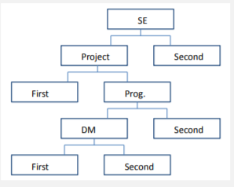

# Classification

## Overview

**Classification**: a _model_ (or _classifier_) is constructed to predict **categorical labels**, such as:

- a bank needing analysis of data in order to learn which loan applicants ar **safe** and which are **risky**
- a medical researcher wants to analyse cancer data in order to predict which one of three _specific_ treatments a patient should receive, **A**, **B** or **C**.

The categories can be represented by **discrete values** - where the ordering among values has no meaning.

**Predictor**: a model constructed to predict a **continuous-valued function** or ordered value.

- if a marketing manager wants to predict _how much_ a given customer will spend, this is a data analysis task known as **numeric prediction**

### **Classification Process**

Classification is a **two-step process**

- **Learning Step/Training Phase** In the first step, a **classifier is built** describing a _predetermined set of data classes/concepts_.
 
  - a classification algorithm builds the classifier by analysing(learning) from a **training set** made up of _database tuples_ and their _associated class labels_.
  - tuple X is represented by an _n_-dimensional attribute vector X = (x1, x2, ..., xn), depicting _n_ measurements made on the tuple from _n_ databse attributes (A1, A2, ..., An).
  - each tuple X is assumed to belong to a _predefined class_ as determined by another database attribute called the **class label** attribute. This attribute is _discrete-valued_ and _unordered_. It is **categorical**; each value serves as a category/class 
  - **Learning**: the training data is analysed by a classification _algorithm_
  - tuples in training set referred to as **training tuples**, sellected from the database under analysis. In classiification, training tuples can be _samples, examples, instances, data points_ or _objects_.
  - Known as **supervised learning** if the _class label of each training tuple is provided_ - it is told the class for each training tuple.
  - **Unsupervised** learning (AKA **Clustering**): the class label of each training tuple is _not known_, and the number or set of classes to be learned may not be known in advance.
  - Learning step can also be viewed as the learning of a _mapping/function_, y = f(X), that can predict the associated class label y of given tuple X

- **Classification Phase**: test data is used to _estimate the accuracy of the classification rules_. If acceptable, the rules are used to classify new data.

  - First, the **predictive accuracy** of the classifier is estimated. 
  - **Test set** must be used, made up of _test tuples_ and their associated _class labels_. If we used the training set to measure this accuracy, the estimate would likely be optimistic as classifier _overfits the data_ - during learning it can incorporate some anomolies of the training data not present in the general data set.
  - Tuples are randomly selected from the general data set, independant of the training tuples.
  - The **accuracy** of a classifier on a given test set = **% of test set tuples that are correctly classified**.
    
    - The associated class label of each test tuple is compared with the learned classifier's class prediction for that tuple.
  - If this accuracy is considered acceptable, classifier can then be used to classify future _unkown_ or _unseesn_ data tuples where the class label is not known.

### **Numeric Prediction**

In prediction, **no class attributes** as the attribute for which values are being predicted are _continuous-valued (ordered)_. Attribute known as the **predicted attribute**.

Data prediction is also a two step process. As with classification, the training set used to build a predictor should **not** be used to assess its accuracy. Independant test set is required.

- Accuracy of a predictor is estimated by computing an **error** based on the _difference between the **predicted value** and the **known value** of y for each test tuple X._

---

## **Bayes Classifiers**

a family of simple probabilistic classifiers, stems from supervised learning where classes are predetermined. Build a data model which can then be used to classify new data. Model produced is usually in the form of a _decision tree_ or a _set of rules_.

**Issues with regard to the model**: Accuracy, Computational Cost & Scalability of Algorithm

### Everyday Classification

Divide a group of objects so each one is assigned to one of a number of **mutually exhaustive and exclusive** categories known as **classes**. Assigned to one and only one class. eg Players who play for teams in the same comp.

- Uses **probability theory** to determine the most likely classification; probability _ranges from 0(impossible) to 1(certain)_

  - Probability of 0.7 means after a long series of observations, probability is 0.7. Greater no. of tests ups accuracy. _A single test does not provide true classification._
  - in general, the sum of probabilities of a set of mutually exclusive & exhaustive events must be 1.
  - a **training set** constiutes the results from sample trials that we use to predict the classification of unclassified instances.
  - **problem!**, if only one classification picked, any unseen istances are _classified in an identical fashion_.

### Prior Probability

Probability of a given event, calculated using the frequency of **desired event** / **all possible outcomes**.

- only takes one attribute, need to cover multiple additional attributes by using..

### Conditional Probability (Posterior Probability)

The Probability of an event occurring **if** we know that an attribute has a particular value (or several variables have particular variables)

- e.g probability of a train being _on time_ if the _season = winter_. i.e the probability of both occuring in the **same instance**.
- = number of **co-ccurences** of both events / number of occurences of **given instance** (in this example, (on time && winter)/(winter))
- Posterior prb. because we can calculate for the classification **after** obtaining info about attribute with particular value. _Prior Probability is calculated before this info is available._
- Can use this to calculate most likely classification for an _unseen instance_.

## Naive Bayes Classifiers

A means of **combining prior and posterior probabilities** into a single formula.

- Use this method for each classification in turn & chose the classification with the **largest value**
- _invert previous formula_: in eg above, use conditional probability that the season in winter given the train is v late. P(winter | v late) is calculated as the **count** of both being true in the **same instance**, divided by the **number of instances for which class is v late**

        P(ci)xP(a1 = v2 | ci)xP(a2 = v2 | ci)x...xP(an = vn | ci)

        c = classification
        i = number of mutually exhaustive and exclusive classifications in set
        a = attributes
        n = number of attributes
        v = value of an attribute

- we calculate the Product of each value of i from 1 to k above and then choose the classification with largest value.
- The calculations are _not_ probabilities - they do not add up to one; they are **porportional**. could normalise but we're only interested in finding the largest value.
- **problem!** - estimating probabilities by relative frequencies can give poor estimates when there is a small number of instances with a given attribute.. in extreme case where it is zero, posterior probability is inevitably also 0.

## Nearest Neighbour 

- **NN** classification is generally used when attributes are _continuous_.
- goal is to estimate the classification of an unseen instance using the classification of instances _closest_ to it.

In this example, we are looking to predict the 3rd, unknown, class. No idea what each attribute represents but even so, it is reasonable to predict that the classification is _negative_, as the attributes between the _negative_ instance and the unseen are more similar.

**k-NN**: classification is based on the _k_ nearest neighbours; usually a small k value (3-5)
- Locate the k training instances that are closest to the unseen instances
- Take the most commonly occuring classification for these k instances

   |   

In this example, the circle encloses the **5 nearest neighbours** of the unseen instance.

- 3 + signs and 2 - signs
- We classify the unseen instance as + 

With 3 attributes, this becomes a 3 dimensional plane and so on, which is harder to visualise but still easy to calculate using an algorithm..

For _n attributes_, we represent the instances as points (a1, a2, ..., an) and (b1, b2, ..., bn) in _n_-dimensional space.

**Goal**: measure the distance between 2 instances with _n_ attributes (in _n_ space). (**dist**(X, Y))

- Three conditions:
  - distance of any point to itself == 0
  - dist(A,B) == dist(B,A)
  - shortest distance between any two points is a straight line. AKA the _triangle inequality_

#### Euclidean Distance

Where u = (_a1_, _a1_, ..., _an_) is an instance in the training set and v = (_b1_, _b2_, ..., _bn_) is the unseen instance, both in an _n_-dimensional space.

- can now classify any unseen instance, with any number of attributes, using a set of known instances.

- **Warning**: large values can skew the Euclidean distance formula, become the **dominant attribute**.
  - Solution is to _normalise_ all attributes; have them all run from 0 to 1. (Large values usually caused by the chosen unit of measurement for an attribute)
  - use the formula (a - min) / (max - min) for each attribute _a_. Requires knowledge of the max and min values for the attribute.

#### Weightings

For use when we don't consider all attributes equal. an extra factor we multiply each instance by in the Euclidean distance formula. Normal to set weights so that sum(weights)== 1.

## Decision Trees

**Decision Tree Induction** is the _learning of decision trees from class-labelled training tuples_. The decision tree itself is a flowchart-like structure where each **internal**(non-leaf) node denotes a _test on an attribute_, each **branch** represents an _outcome_ for the test and each **leaf** node (terminal node) holds a _class label_.

Decision trees can also be seen as a **set of decision rules**. The below example sees if a golfer will or won't play:

 

### The Decision Tree Algorithm

- Tree starts as single node _N_, representing the _training tuples_ in _D_.
- **if** the tuples in _D_ are of the same class, then node _N_ becomes a **leaf** and is _labelled with a class_.
- **else**, algorithm calls an **AttributeSelection()** method to determine the _splitting critereon_.
  - The splitting criterion indicates which attribute to test at node _N_ by determining the best way to seperate/partition the tuples in _D_ into individual classes.
  - It also tells us which branches to _grow_ from node _N_, determinded by the outcomes of the chosen test.
  - This may indicate a _split-point_ or _split_subset_.
  - A partition is deemed as _pure_ if all of its tuples belong to the same class
  - If we split tuples in _D_ according to the mutually exclusive outcomes of splitting criterion, the partitions should be pure af.
- node _N_ is labelled with the splitting criterion, which serves as a test at the node.
- A branch is "grown" from node _N_ for each outcome of the splitting criterion.
- The tuples in _D_ are partitioned accordingly.

There are 3 possibilities for the splitting attribute A:

1) A is **discrete**-valued:
  - The outomes of the test at _N_ correspond directly to the known values of _A_.
  - Branch created with each known value of _A_ and labelled with that value.
  - Partition Dj == the subset of class-labelled tuples in _D_ having value aj of _A_.
  - _A_ need not be considered in any future partitioning as all tuples in a given partition have the same value.

2) A is **continuous**-valued:
  - The test at _N_ has **two** possible outcomes depending on the split point returned by AttributeSelection() mehthod
    - _A <= split-point_
    - _A > split-point_
  - split-point (_a_) can be taken as the _midpoint_ of two known adjacent values of _A_.
  - Two branches grown from _N_ and labelled according to the outcomes
  - Tuples partition such that _D1_ holds the subset of class-labelled tuples in _D_ for which _A <= split-point_, and _D2_ holds the rest.

3) A is **discrete**-valued **and** a binary tree must be produced:
  - The test at node _N_ is of the form _A ∈ SA?_, where SA is the splitting subset for _A_ returned by AttributeSelection()
    - it is a subset of the known values of _A_.
  - **if** a given tuple has the value a_j_ of_A_ and if a_j_ ∈ SA?, then the test at _N_ is satisfied.
  - Two branches are grown from _N_.
  - By convention, the left branch of N is labelled _yes_ so that _D1_ corresponds to the subset of class-labelled tuples in _D_ that satisfy the test.
  - The right branch is labelled _no_, represents the subset that do not satisfy the test.

**Terminating Conditions**:

The algorithm uses the same process recursively to form a decision tree at each resulting partition of _D_. Stops when one of the following is true:

- All of the tuples in partition _D_ represented at node _N_ belong to the same class.
- There are no remaining attributes on which tuples can be further partitioned (in this case, majority vote applied and _N_ converted to a leaf with the label of the most common class)
- No tuples exist for a given branch; a partition is empty (a leaf is created with the majority class in _D_)

Goal is to develop classification rules from training set data where a decision tree is formed.

### Decision Tree Functions

Two functions: 

**Data compression**

**Prediction**

 

**Compression**: the decision tree above has 5 decision rules, with a total of 14 terms (avg 2.8 terms per rule)

Each instance in the Degrees dataset could also be regarded as a rule
- eg if SE = A and Prog = B and HCI = A and DM = B and Project = B then Class = SECOND..

There are 26 such rules, one per instance, each with 5 terms. Total = 130. Even with a small training set, the reduction from 130 to 14 is almost 90%!

### TDIDT Algorithm

**Top-Down Induction of Decision Trees**, which produces decision rules in the implicit form of a decision tree.

Decision trees are generated by repeatedly splitting on the values of attributes. Known as **recursive partitioning**.

ALGORITHM (Basic):

- **if** all the instances in the training set belong to the same class
- **then** return the value of the class
- **else**
  - select an attribute _A_ to split on (never select an attribute twice in the same branch - important for ensuring termination)
  - sort the instances in the training set into subsets, one for each value of _A_
  - return a tree with one branch for each _non-empty_ subset, each branch having a descendant subtree or a class value produced by applying the algorithm recursively.

**Adequacy Condition for TDIDT**: No two instances with the same values for all the attributes may belong to different classes. This way we are ensured of a consistent training set.

**Problem**: The TDIDT algorithm is _underspecified_, it specifies 'Select _A_ to split on' but no method is given for doing so..
- Provided adequacy condition is satisfied, the alg is guaranteed to terminate and any selection of attributes will produce a decision tree, but decision trees may be of little value for predicting the classification of unseen instances due to underspecification
- A good choice of attributes to split on is crucial to the success of this approach

### Attribute Selection Strategies

- _takefirst_: for each branch, take the attributes in the order in which they appear in the training set (in above, would be SoftEng, Prog, HCI, DM and Project)
- _takelast_: as per takefirst, but working from right to left
- _random_: make a random selection with equal probability of each attribute being selected.

Below are the results from using all three approaches. The last two columns record the number of branches in the larest and the smallest of the trees generated for each of the datasets.

As seen, there is a considerable difference between all. Even though in principle all attributes an be chosen in any way, the difference between a good and bad choice is considerable.

**note** decision tree results should not be classed as 'correct' or 'incorrect', but rather as 'compatible with the data from which [the decision tree] was generated'

## Attribute Selection Measures

Heursitics for selecting the splitting criterion that best seperates data partition _D_ of class-labelled training tuples into individual classes. Conceptually, this is the one that most closely results in a pure partition (all tuples falling into the partition belong to the same class)

AKA _splitting rules_ because they determine how to split the tuples at a given node.

The Attribute selection measure provides a ranking for each attribute describing the training tuples, then the attribute with the best score for the measure is chosen as the splitting attribute.

### Ranking Attributes

- If the splitting attribute is continuous **or** if restricted to a binary tree, then either a split point or a splitting subset (respectively) must also be determined as part of the splitting criterion.
- Tree node created for partition _D_ is labelled with the splitting criterion; branches are grown for each outcome of the criterion and he tuples are partitioned accordingly.

**Fundamentals**

Let Data partition _D_ == a training set of class-labelled tuples.

Assume the class label attribute has _m_ distinct values defining _m_ distinct classes Ci (_i_= 1,2,...,_m_)

Ci,D == set of tuples of class Ci in _D_.

| _D_ | and | Ci,D | denote the number of tuples in _D_ and Ci,D respectively

**Three popular attribute selection measures:**

1) **Information Gain**
  - uses the value (**information content**) of messages
  - let node _N_ represent the tuples of partition _D_.
  - attribute with the _highest_ information gain is chosen as the splitting attribute for node N.
  - this attribute minimizes the info needed to classify the tuples in resulting partitions and reflects the least **entropy** (randomness) in these partitions
  - this approach minimizes the expected number of tests needed to classify a given tuple and guarantees that a simple tree is found.

The expected information needed to classify a tuple in _D_ is given by:

- 
  - pi == the probability that an arbitrary tuple in D belongs to class Ci, estimated by | Ci,D | / | D |. _countforthatclass / _coundfordata_
  - A log function to the base 2 is used because the info is encoded in bits
  - Info(D) is the _average_ amount of info needed to identify the class label of a tuple in _D_.

The expected information required to classify a tuple from _D_ **after partitionaing by A** is given by:

- 
  - InfoA(D) == the _expected_ info required to classify a tuple from _D_ after partitioning by _A_
  - The smaller the expected information still required, the greater the purity of the partition.
  - |Dj| / |D| is the weight of the jth partition.

**INFORMATION GAIN** is the _difference_ between the original info required (based on porportion of classes) and the new requirement (obtained after partitioning). Gain(A) tells us how much would be gained by branching on A.

- **Gain(_A_) = Info(_D_) - InfoA(_D_)**

The attribute with the highest Information Gain is chosen as the splitting attribute at _N_.

**Note** this is for discrete-valued attributes

- For continuous-valued attributes, we need to determine the _best split point_ for A.
  - Sort the values of A in increasing order.
  - The midpoint between each pair of adjacent values can be considered a possible split point
  - For each possible split point, evaluate InfoA(D)
  - The point with the minimum expected info requirement for A is selected as the split point for A.

2) **Gain Ratio**
  - an extension to Info Gain that attempts to overcome the bias toward tests with many outcomes
  - applies a form of normalisation to info gain using a **split information value** defined analogously with _Info(D)_ as:
  
  

  - the SplitInfo value represents the potential info generated by splitting the training data set D into v partitions, corresponding to the v outcomes of a test on A.
  - for each outcome, the number of tuples having that outcome are considered wrt the total number of tuples in d.
  - reduces bias toward multi-valued attributes by taking the _number_ and _size_ of branches into account.

**GAIN RATIO**:

- **GainRatio(_A_) = Gain(_A_) / SplitInfo(_A_)

The attribute with the maximum gain ratio is selected as the splitting attribute.

**Note** as the split info approaches 0, the ratio becomes unstable...

- to avoid this, apply the constraint whereby the info gain on the test selected **must** be latge, at least as great as the average gain over all tests examined. **DO NOT** use this method if Gain(A) values are small. 

3) **Gini Index**
  - measures the **impurity** of_D_, a data partition or set of training tuples

  

  - pi == probability that a tuple in D belongs to class Ci, estimated by | Ci,D | / | D |
  - Sum is computed over _m_ classes

The Gini Index considers a **binary split** for each attribute.
- if A is discrete-valued, examine all possible subsets that can be formed using known values of A.
  - each subset SA can be considered as a binary test for the attribute A of the form _A_ ∈ SA?
  - given a tuple, this test is satisfied if the value of A for the tuple is among the values listed in the subset.
  - if A has _v_ possible values, there are 2_v_ possible subsets.

- if A is continous-valued, each possible split point must be considered.
  - strategy similar to info gain where the midpoint between each pair of _sorted_ adjacent values is taken as a possible split-point
  - the point giving the minimum Gini Index for a given attribute is taken as the split point of that attribute.
  
The **reduction in impurity** incurred by a binary split on attribute _A_ is: 

    ∆Gini(A) = Gini(D) − GiniA(D)

The attribute that maximises this reduction is selected as the splitting attribute. This attribute and eithe its splitting subset or point (depending on discrete or continuous) together form the splitting criterion.

**Note** Gini index is biased toward multivalued attributes, has difficulty when the number of classes is large

#### All measures of attribute selection are biased in some way. but they all give reasonably good results in practice.
